# Network AI 🧠

> **AI-powered LinkedIn networking platform designed for fresh graduates and job seekers**

Network AI is a microservice-based application that combines intelligent LinkedIn search capabilities with resume analysis tools. It helps users find relevant profiles, companies, and jobs while providing personalized resume optimization recommendations.


## ✨ Features

### 🔍 Smart LinkedIn Search
- **Semantic Search**: Use natural language to find LinkedIn profiles, companies, and jobs
- **AI Query Enhancement**: Powered by Google Gemini to optimize search queries
- **Real-time Results**: Fast, cached results with structured data extraction
- **Advanced Filtering**: Category-based search with customizable limits

### 📄 Resume Analysis Wizard
- **PDF Processing**: Upload and parse resume PDFs using Landing AI
- **Job Matching**: Analyze resumes against job postings from URLs
- **Match Scoring**: Get percentage compatibility scores (0-100%)
- **Actionable Insights**: Receive keyword analysis and improvement suggestions
- **Web Scraping**: Auto-extract job requirements from posting URLs

### 🚀 Modern Tech Stack
- **Frontend**: Next.js 15 with TypeScript, Tailwind CSS, and ShadCN/UI
- **Backend**: FastAPI microservices with Python
- **AI Integration**: Exa AI, Google Gemini, FireCrawl, and Landing AI
- **Authentication**: Supabase Auth with Google OAuth
- **Databases**: Supabase (PostgreSQL + Object Storage) + MongoDB

---

## 🛠️ Technology Stack

| Category | Technologies |
|----------|-------------|
| **Frontend** | Next.js, TypeScript, Tailwind CSS, ShadCN/UI, Zustand |
| **Backend** | FastAPI (Python) |
| **AI & External Services** | Exa AI, Google Gemini, FireCrawl, Landing AI |
| **Databases & Auth** | Supabase (Auth, Postgres DB, Object Storage), MongoDB (Caching Search Results) |
| **Infrastructure & DevOps** | Docker & Docker Compose, Nginx, GitHub Actions |

---

## 📂 Project Structure

The project is organized as a monorepo with a clear separation between the frontend client and backend microservices.

```
networkai/
├── 🐳 docker/                     # Nginx configuration
├── 🌐 frontend/                   # Next.js application
│   ├── app/                       # App Router pages and layouts
│   │   ├── auth/                  # Authentication pages
│   │   ├── dashboard/             # Main dashboard and features
│   │   └── page.tsx               # Landing page
│   ├── components/                # React components
│   │   ├── ui/                    # ShadCN/UI components
│   │   ├── layout/                # Header, navigation
│   │   ├── search/                # Search-related components
│   │   └── resume/                # Resume analysis components
│   ├── services/                  # Frontend API service layers
│   ├── store/                     # Zustand state management
│   ├── types/                     # TypeScript type definitions
│   └── lib/                       # Utilities and configurations
│
├── 🔧 services/                   # Backend microservices
│   ├── 🔍 search-service/         # FastAPI service for LinkedIn search
│   │   ├── app/
│   │   │   ├── core/              # Configuration, database, auth
│   │   │   ├── models/            # Pydantic models and parsers
│   │   │   ├── routers/           # FastAPI route handlers
│   │   │   └── services/          # Business logic (Exa AI, Gemini, Cache)
│   │   ├── tests/                 # Unit and integration tests
│   │   └── main.py                # FastAPI application entry
│   │
│   └── 📄 resume-service/         # FastAPI service for resume analysis
│       ├── app/
│       │   ├── core/              # Configuration, database, auth
│       │   ├── models/            # Pydantic models
│       │   ├── routers/           # FastAPI route handlers
│       │   └── services/          # Business logic (Landing AI, FireCrawl, Gemini)
│       ├── tests/                 # Unit and integration tests
│       └── main.py                # FastAPI application entry
│
├── 🐳 docker-compose.yml          # Orchestrates the API gateway
├── 📖 README.md                   # You are here!
└── ...                            # Config files (.env, .gitignore)
```

---

## 🚀 Getting Started

Follow these steps to set up and run the project locally.

### Prerequisites

- **Git**
- **Docker & Docker Compose**
- **Node.js** (v18+) and **pnpm**
- **Python** (v3.10+)

### 1. Clone the Repository

```bash
git clone https://github.com/AmirUpSkill/Network-AI.git
cd Network-AI
```

### 2. Environment Setup

You need to create three environment files and populate them with your API keys and secrets:

- `services/search-service/.env` (for the Search Service)
- `services/resume-service/.env` (for the Resume Service)  
- `frontend/.env.local` (for the Next.js App)

Refer to the `.env.example` files in each directory for the required variables.

#### Required API Keys
- **Exa AI API Key** - For LinkedIn semantic search
- **Google Gemini API Key** - For AI query enhancement and analysis
- **FireCrawl API Key** - For web scraping job postings
- **Landing AI API Key** - For PDF resume parsing
- **Supabase URL & Keys** - For authentication and database
- **MongoDB URI** - For search result caching

### 3. Run the Application

Follow this sequence to start all parts of the application:

#### 1. Start the API Gateway:
```bash
docker-compose up -d
```

#### 2. Start the Search Service (in a new terminal):
```bash
cd services/search-service
python -m venv .venv
source .venv/bin/activate  # or .venv\Scripts\activate on Windows
pip install -r requirements.txt
uvicorn main:app --host 0.0.0.0 --port 8001
```

#### 3. Start the Resume Service (in a new terminal):
```bash
cd services/resume-service
python -m venv .venv
source .venv/bin/activate  # or .venv\Scripts\activate on Windows
pip install -r requirements.txt
uvicorn main:app --host 0.0.0.0 --port 8002
```

#### 4. Start the Frontend (in a new terminal):
```bash
cd frontend
pnpm install
pnpm dev
```

### 4. Access the App

- **Frontend Application**: http://localhost:3000
- **API Gateway**: http://localhost:8000
- **Search Service Docs**: http://localhost:8001/docs
- **Resume Service Docs**: http://localhost:8002/docs

---

## 📜 API Contracts

The backend exposes a versioned API through the gateway at `/v1`.

### Search Service (`/v1/search`)
- **POST /linkedin**: Executes an AI-powered semantic search
- **GET /history**: Retrieves the user's recent search history

### Resume Service (`/v1/resume`)
- **POST /upload**: Uploads a resume PDF and returns a `file_id`
- **POST /analyze-auto**: Analyzes an uploaded resume against a job URL

### Authentication
All API endpoints require authentication via Supabase JWT tokens in the `Authorization: Bearer <token>` header.

Full OpenAPI specs are available at `/docs` on each running backend service (e.g., http://localhost:8001/docs).

---

## 🏗️ Architecture Overview

```mermaid
graph TB
    User[👤 User] --> Frontend[🌐 Next.js Frontend]
    Frontend --> Gateway[🚪 Nginx API Gateway]
    
    Gateway --> SearchService[🔍 Search Service]
    Gateway --> ResumeService[📄 Resume Service]
    
    SearchService --> MongoDB[(🍃 MongoDB)]
    SearchService --> ExaAPI[🔗 Exa AI API]
    SearchService --> GeminiAPI[🤖 Gemini API]
    
    ResumeService --> Supabase[(💾 Supabase)]
    ResumeService --> LandingAI[📋 Landing AI]
    ResumeService --> FireCrawl[🔥 FireCrawl]
    ResumeService --> GeminiAPI
    
    Frontend --> SupabaseAuth[🔐 Supabase Auth]
```



---

## 🔧 Development

### Project Architecture Principles

1. **API-First Design**: All backend services expose OpenAPI specifications
2. **Microservice Architecture**: Loosely coupled services with single responsibilities
3. **Type Safety**: End-to-end TypeScript with Zod validation
4. **State Management**: Zustand for predictable state updates
5. **Authentication**: JWT-based auth with automatic token refresh
6. **Caching Strategy**: MongoDB for search results, Supabase for user data

### Running Tests

```bash
# Search Service Tests
cd services/search-service
pytest

# Resume Service Tests  
cd services/resume-service
pytest

# Frontend Tests (if implemented)
cd frontend
pnpm test
```

---

## 📈 Features Roadmap

- [ ] **Chrome Extension** for direct LinkedIn integration
- [ ] **Bulk Resume Analysis** for multiple job applications
- [ ] **Interview Preparation** with AI-generated questions
- [ ] **Networking Recommendations** based on career goals
- [ ] **Application Tracking** with status management
- [ ] **Mobile App** (React Native)

---

## 🤝 Contributing

1. Fork the repository
2. Create a feature branch (`git checkout -b feature/amazing-feature`)
3. Commit your changes (`git commit -m 'Add some amazing feature'`)
4. Push to the branch (`git push origin feature/amazing-feature`)
5. Open a Pull Request

---

## 📄 License

This project is licensed under the MIT License - see the [LICENSE](LICENSE) file for details.

---

## 🙏 Acknowledgments

- **Exa AI** for powerful semantic search capabilities
- **Google Gemini** for AI-powered analysis and enhancement
- **Supabase** for seamless authentication and database management
- **Next.js Team** for the amazing React framework
- **ShadCN** for beautiful, accessible UI components

---

<div align="center">

**Built with ❤️ by [AmirUpSkill](https://github.com/AmirUpSkill)**

*Empowering job seekers with AI-driven networking tools*


</div>
